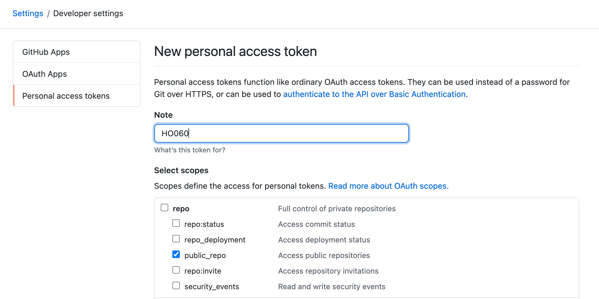

# Cloning this repository into your App Studio Dev Space

These instructions describe how you should clone this repository into your App Studio Dev Space for this Hands-on workshop.

## Generate a Personal Access Token

The GitHub enterprise server that hosts this repository is configured to require Personal Access Tokens (PATs), rather than passwords, for authentication. You'll need one to authenticate the `git clone` command you'll run shortly.

👉 Generate one now, by going to the [New personal access token](https://github.tools.sap/settings/tokens/new) area on this GitHub enterprise server, giving the token a name (e.g. `HO060`) and specifying the following scope (it's the only one required): `repo: public_repo`, like this:



After selecting the `Generate token` button at the bottom of the form, you'll be presented with your token, like this:


👉 Make sure you leave this token available for copying and using in a subsequent step here.

## Move into the `projects/` directory

👉 In a terminal in your Dev Space (open a new one if required with `Terminal -> New Terminal`) ensure you're in the `projects/` directory in your home directory; this is a directory that is pre-created when you set the Dev Space up.

```bash
cd $HOME/projects/
```

## Invoke the repository cloning operation

👉 Run the clone command for this repository:

```bash
git clone https://github.tools.sap/dkom2022/HO060.git
```

You'll be prompted by the App Studio (near the top) for your credentials; enter your username:


and also the token you just generated (copy it from the GitHub page), when asked for "password or token":


Choose how you want the credentials saved (you only need them for this session):


At this point the clone operation should be complete and a new directory `HO060` should be in your `projects/` directory:

```
user: projects $ git clone https://github.tools.sap/dkom2022/HO060.git
Cloning into 'HO060'...
remote: Enumerating objects: 9, done.
remote: Counting objects: 100% (9/9), done.
remote: Compressing objects: 100% (8/8), done.
remote: Total 181 (delta 0), reused 6 (delta 0), pack-reused 172
Receiving objects: 100% (181/181), 1.83 MiB | 11.04 MiB/s, done.
Resolving deltas: 100% (70/70), done.
user: projects $ ls
HO060
user: projects $
```

## Open your home directory in the Explorer

👉 At this point you may want to open your home directory in the Explorer (so you can look around at the directory structure and the files). Do this by using menu path `File -> Open...` and specifying the `user/` directory as shown:


The Dev Space should restart and you should be able to explore the contents of this repository, and also the contents of your `.bashrc` file and `bin/` directory, for example.

👉 Don't forget to open up a new terminal in the restarted Dev Space so you can continue where you left off now, back in the exercise.
