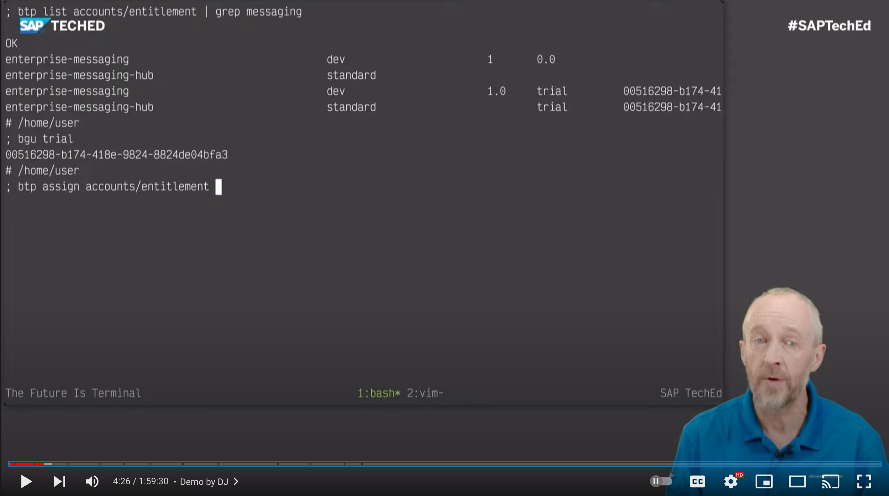
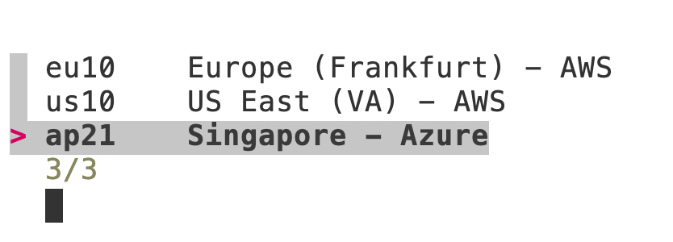

# Exercise 08 - More on GUIDs, and resource creation with the btp CLI

At the end of this exercise, you'll be a little more familiar and comfortable with the globally unique identifiers (GUIDs) for resources on BTP, and have also put the btp CLI to practical use, using it to create resources in your SAP BTP account.

## Create a new subaccount in a new directory

In this section you'll use the btp CLI to examine what you have in your global account, and then create a new subaccount within a new directory. Along the way you'll see how GUIDs play a significant role in identifying the resources you want to manipulate.

### Examine what you have

Start out this exercise by looking to see what exists in your global account so far.

👉 Similar to what you did in an earlier exercise, use the following invocation to get details of what you have, ensuring you're in your home directory before you start:

```bash
cd $HOME
btp get accounts/global-account --show-hierarchy | trunc
```

You should see output similar to this:

```text
Showing details for global account fdce9323-d6e6-42e6-8df0-5e501c90a2be...

├─ 8fe7efd4trial (fdce9323-d6e6-42e6-8df0-5e501c90a2be - global account)
│  ├─ trial (f78e0bdb-c97c-4cbc-bb06-526695f44551 - subaccount)

type:            id:                                    display name:   parent id:
global account   fdce9323-d6e6-42e6-8df0-5e501c90a2be   8fe7efd4trial
subaccount       f78e0bdb-c97c-4cbc-bb06-526695f44551   trial           fdce9323-d6e6-42e

OK
```

### Create a new directory

In this example (from a trial account), we see a single subaccount with the display name "trial" exists as a direct child of the global account. You'll be creating a new subaccount, but first, to make it slightly more interesting (i.e. not because you need to, technically) you should create a directory to contain it.

👉 Use the following command (feel free to explore the options here and before subsequent command invocations with the general `help` action (or `--help`)):

```bash
btp create accounts/directory --display-name codejam-directory
```

> Remember that you can use the autocomplete feature that you set up [in a previous exercise](../03-autocomplete-and-exploration/README.md) to help you construct this and all other btp CLI commands.

The output should look something like this:

```text
Creating directory in global account fdce9323-d6e6-42e6-8df0-5e501c90a2be...

directory id:         f4c7d60e-627c-4fab-8e67-603b20b84f72
display name:         codejam-directory
description:
directory features:   DEFAULT
created by:           qmacro+blue@gmail.com
parent id:            fdce9323-d6e6-42e6-8df0-5e501c90a2be
parent type:          global account
state:                OK
state message:        Directory created.

Command runs in the background.
Use 'btp get accounts/directory' to verify status.
```

> Notice that this operation is asynchronous, a common trait for btp CLI commands that manipulate resources.

You can either follow the hint and try `btp get accounts/directory` to check whether the directory has been created, but you'll need to specify the GUID - the directory ID shown in the output above.

👉 For now, just use the previous "show hierarchy" command to check, like this:

```bash
btp get accounts/global-account --show-hierarchy | trunc
```

If the directory has been created, you'll see it in the tree display and also listed, like this:

```text

OK

Showing details for global account fdce9323-d6e6-42e6-8df0-5e501c90a2be...

├─ 8fe7efd4trial (fdce9323-d6e6-42e6-8df0-5e501c90a2be - global account)
│  ├─ trial (f78e0bdb-c97c-4cbc-bb06-526695f44551 - subaccount)
│  ├─ codejam-directory (205508c6-08fc-48ed-b531-20712260d5af - directory)

type:            id:                                    display name:     parent id:
global account   fdce9323-d6e6-42e6-8df0-5e501c90a2be   8fe7efd4trial
subaccount       f78e0bdb-c97c-4cbc-bb06-526695f44551   trial             fdce9323-d6e6-42e
directory        205508c6-08fc-48ed-b531-20712260d5af   codejam-directory fdce9323-d6e6-42e
```

### Examine the directory via the GUID

Recall the other command that was suggested: `btp get accounts/directory`. Looking at the help for this command (with `btp get accounts/directory --help`) tells us that there's a main parameter `ID` that's required.

In other words, if you try `btp get accounts/directory codejam-directory` you will be somewhat underwhelmed. The string "codejam-directory" is the display name. You have to use the GUID.

You could search for the GUID and copy-paste it, but this isn't ideal and doesn't lend itself at all to automation.

👉 Instead, take a look at the `btpguid` script that was demonstrated (as `bgu`) in the [SAP TechEd 2021 Developer Keynote](https://blogs.sap.com/2021/11/17/sap-teched-2021-developer-keynote/).



It's an example of a bit of Bash scripting around the btp CLI to provide a useful utility. There's a link to [a version of that script](../../scripts/btpguid) in the directory containing this exercise. An analysis of the script, how the data is parsed in text form, and then how it's parsed in JSON form, is available in a two-part blog post series - see the [Further reading](#further-reading) section at the end.

Let's try it out.

👉 First, for ease of execution, create a symbolic link in your `$HOME/bin/` directory to point to where this script is right now. This is so you can call `btpguid` from wherever you are, because `$HOME/bin/` is [in your PATH](../01-installing/README.md#add-your-bin-directory-to-the-path):

```bash
ln -s $HOME/projects/cloud-btp-cli-api-codejam/scripts/btpguid $HOME/bin/
```

You can now use the `btpguid` script to give you the GUID of a subaccount or directory (and you don't need to prefix it with `./` because the shell will now find the script in your PATH).

👉 Try it now:

```bash
btpguid codejam-directory
```

This should return the GUID of your newly created directory.

👉 Now use the same call, but in-line, using the shell's command substitution (`$(...)`) facility, in the context of the previously suggested btp CLI invocation to get the details of the newly created directory:

```bash
btp get accounts/directory $(btpguid codejam-directory)
```

You should see output similar to this:

```text
Showing details for directory f4c7d60e-627c-4fab-8e67-603b20b84f72...

directory id:         f4c7d60e-627c-4fab-8e67-603b20b84f72
display name:         codejam-directory
description:
directory features:   DEFAULT
created by:           qmacro+blue@gmail.com
parent id:            fdce9323-d6e6-42e6-8df0-5e501c90a2be
parent type:          global account
state:                OK
state message:        Directory created.


OK
```

### Create a new subaccount in the directory

Within this new directory, you are now going to create a new subaccount.

👉 First, check which regions are available to you for a new subaccount, and pick one. We covered the relevant command in [a previous exercise](../04-retrieving-parsing-json-output/README.md#list-the-available-regions):

```bash
btp list accounts/available-region
```

👉 Now check the help on the command you're going to be using, with:

```bash
btp create accounts/subaccount --help
```

There's quite a bit that can be specified; let's keep things as simple as possible and specify the minimum. One thing you're going to need to specify is a subdomain; for the sake of this hands-on workshop, use your global account subdomain as part of this subaccount's subdomain value. You can retrieve the global account subdomain value with `btp --format json get accounts/global-account | jq -r .subdomain` - this will be incorporated into the `create` command below.

👉 First, pick a region available to you that supports CF and save that as a variable; the example here is setting it to `eu10` but you may need to specify a different value:

```bash
region=eu10
```

👉 Now request the subaccount creation, like this (this example uses the global account display name for part of the subdomain value):

```bash
btp create accounts/subaccount \
  --directory $(btpguid codejam-directory) \
  --display-name codejam-subaccount \
  --region "$region" \
  --subdomain "$(btp --format json get accounts/global-account | jq -r .subdomain)-codejam-subaccount"
```

> Have a look at the optional section [Dynamic region choice](#dynamic-region-choice) at the end of this exercise to see how you might make this region choice dynamic.

This creation also runs in the background.

👉 You can check the results with the usual command, like this:

```bash
btp get accounts/global-account --show-hierarchy | trunc
```

And the output should then show the new subaccount in the correct place in the tree, something like this:

```text
OK

Showing details for global account fdce9323-d6e6-42e6-8df0-5e501c90a2be...

├─ 8fe7efd4trial (fdce9323-d6e6-42e6-8df0-5e501c90a2be - global account)
│  ├─ trial (f78e0bdb-c97c-4cbc-bb06-526695f44551 - subaccount)
│  ├─ codejam-directory (cd0c871e-a8f3-4a35-94b9-5af8dbfd185c - directory)
│  │  ├─ codejam-subaccount (4dc80103-6f20-4582-8aec-858bb6319d30 - subaccount)

type:            id:                                    display name:      parent id:
global account   fdce9323-d6e6-42e6-8df0-5e501c90a2be   8fe7efd4trial
subaccount       f78e0bdb-c97c-4cbc-bb06-526695f44551   trial              fdce9323-d6e6-42e
directory        cd0c871e-a8f3-4a35-94b9-5af8dbfd185c   codejam-directory  fdce9323-d6e6-42e
subaccount       4dc80103-6f20-4582-8aec-858bb6319d30   codejam-subaccount cd0c871e-a8f3-4a3
```

## Further experimentation

You can see how easy the btp CLI makes managing resources on BTP. It's definitely worth experimenting further, creating, modifying and querying resources using different combinations of btp CLI actions, groups and objects.

👉 Take a few moments to examine the [btpguid](../../scripts/btpguid) script. There are a few things worthy of note:

* The script isn't long, and half of it is made up of comments
* A lot of the heavy lifting is done with `jq`, in the `parse` function
* The script will optionally also set the chosen subaccount or directory as target

## Dynamic region choice (optional)

This is an optional section that you might want to take a look at if you finish this exercise early. Instead of deciding on the region in advance, and then specifying it directly in the `btp create accounts/subaccount` call, you could use a tool like [fzf](https://github.com/junegunn/fzf), the command line fuzzy finder.

👉 Download it straight into your `$HOME/bin/` directory like this:

```bash
curl \
  --silent \
  --location \
  --url "https://github.com/junegunn/fzf/releases/download/0.29.0/fzf-0.29.0-linux_amd64.tar.gz" \
  | tar -C $HOME/bin/ -xzf - fzf
```

👉 Run it directly to see (a) that it exists and is executable, and (b) what it feels like:

```bash
fzf
```

In its default state, `fzf` will look for files and present you with a fuzzy-finder interface to narrow the choice down as you type (you can quit out of the interface with `Ctrl-C`).

👉 Now try it out with the regions, encapsulating the invocation into a function:

```bash
selectregion() {
  btp --format json list accounts/available-regions \
  | jq -r '.datacenters[] | "\(.region)\t\(.displayName)"' \
  | fzf --color=light \
  | cut -f 1
}
```

Here's what this function does:

* asks for the regions in JSON format
* extracts the region and display name and outputs that information in tab-separated form
* presents the list for selection (using `fzf`)

and then, once you've selected an entry from the list, it:

* emits the first field (the region)

> There are many more options to `fzf` to take care of edge cases, this example is just to illustrate the basics.

👉 Try it out now to see what happens (use the cursor keys or type characters to match, then hit Enter when you're done):

```bash
selectregion
```

You can also incorporate this into the create command, thus:

```bash
btp create accounts/subaccount \
  --directory $(btpguid codejam-directory) \
  --display-name codejam-subaccount \
  --region "$(selectregion)" \
  --subdomain "$(btp --format json get accounts/global-account | jq -r .subdomain)-codejam-subaccount"
```

and you'd be presented with a list to select from first, like this:



## Summary

At this point you should feel more comfortable using the btp CLI on the command line, understand the distinction between display names and GUIDs, know how to determine GUIDs, and be already thinking of how you can harness the power of the btp CLI in automated mechanisms for your own projects.

## Further reading

* [Getting BTP resource GUIDs with the btp CLI – part 1](https://blogs.sap.com/2021/11/24/getting-btp-resource-guids-with-the-btp-cli-part-1/)
* [Getting BTP resource GUIDs with the btp CLI – part 2 – JSON and jq](https://blogs.sap.com/2021/12/01/getting-btp-resource-guids-with-the-btp-cli-part-2-json-and-jq/)

---

## Questions

If you finish earlier than your fellow participants, you might like to ponder these questions. There isn't always a single correct answer and there are no prizes - they're just to give you something else to think about.

1. The btp CLI command you used to [Create a new subaccount in the directory](#create-a-new-subaccount-in-the-directory) had quite an involved-looking construction for the value of the `--subdomain` parameter: `"$(btp --format json get accounts/global-account | jq -r .subdomain)-codejam-subaccount"`. Can you pick this apart and understand how it works?
1. How does the [btpguid](btpguid) script set the chosen subaccount as target?
1. In the `jq` part of the [btpguid](../../scripts/btpguid) script that parses the JSON formatted output of the `btp get accounts/global-account --show-hierarchy` command, what technique is used to ignore the global account?

---

[Next exercise](../09-deleting-resources-with-api/README.md)
