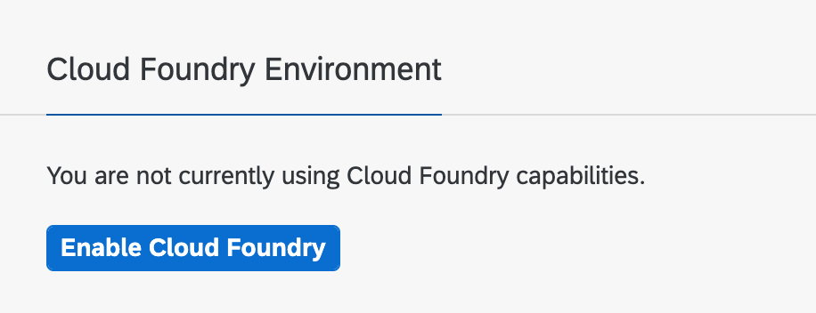
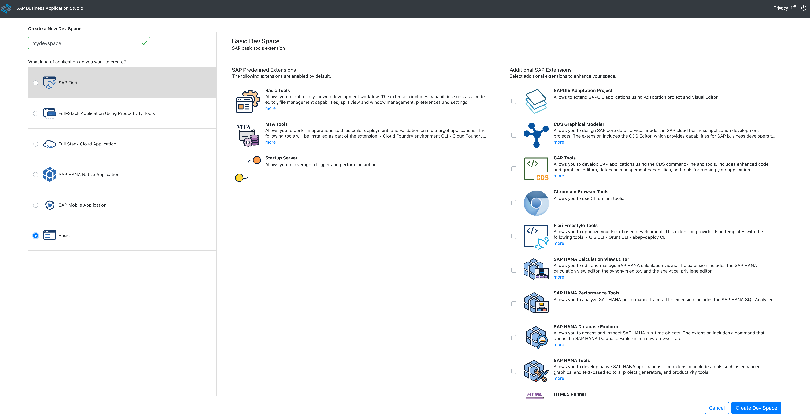

# Prerequisites

These prerequisites are essential to a successful CodeJam. As an attendee, please ensure that you have worked through all of them and set things up before the day of the CodeJam event itself.

## SAP BTP account

You must have an SAP BTP account.

This can be a productive account, or (if still available) an active (unexpired) trial account. It's important that the account has [Feature Set B](https://help.sap.com/products/BTP/65de2977205c403bbc107264b8eccf4b/caf4e4e23aef4666ad8f125af393dfb2.html) Cloud Management Tools. You can check this from the BTP Cockpit using the "About" option which will show something like this:

If you don't have an account right now, you can get one by following the instructions in this tutorial: [Get an SAP BTP Account for Tutorials](https://developers.sap.com/tutorials/btp-cockpit-setup.html).

## Subaccount and Cloud Foundry environment

In your account, you must have a subaccount with a Cloud Foundry environment set up. This is an environment that's available in the free tier. Make sure the environment is created and you have an organization and space within it.

If you need to do this, use the Enable Cloud Foundry button in the SAP BTP Cockpit, selecting the "standard" plan (or another free one if it is available):

Then, once the environment is created (it will have asked you for the name of an organization which it will automatically create), use the Create Space button to create a space. If you're stuck for a name, use "dev":

## SAP Business Application Studio

Your account should have a subscription set up to the SAP Business Application Studio (App Studio). If you have a trial account then this subscription may already be set up for you. Otherwise, use the BTP Cockpit to find the entry in the Service Marketplace and create a subscription manually, with the "free" plan (see [Application Plans](https://help.sap.com/products/SAP%20Business%20Application%20Studio/9d1db9835307451daa8c930fbd9ab264/2c72917df87e47c290e061a556d92398.html?locale=en-US) for more info).

You should end up with something that looks like this:

If you see an "Access Denied" message when attempting to access the App Studio, then you are most likely missing some role collection assignments. If this is the case, go to the Security section in the SAP BTP Cockpit and assign the following role collections to your user:

* Business_Application_Studio_Developer

You may also assign yourself any other App Studio related role collections, but this one is the key role collection that you need.

### A Basic Dev Space set up

Within the App Studio you should set up a "Basic" Dev Space ready for the CodeJam.

When setting this up, please make sure you also select the "MTA Tools" in the "Additional SAP Extensions" list (this will give you the `cf` command line tool, amongst other things).

Give the Dev Space a name, and hit "Create Dev Space".

## Docker Desktop

The last exercise listed, called "BTP tools in containers", is a bonus exercise; whether we get to it depends on how we get through the other exercises. It may just be presented as a demo, but you can also work through it on your own after the CodeJam has finished. If you want to be able to work through this bonus exercise, you will need Docker Desktop installed on your machine.

> The license for Docker Desktop has changed - see [Docker is Updating and Extending Our Product Subscriptions](https://www.docker.com/blog/updating-product-subscriptions/) for an overview.

## Knowledge and experience

From a knowledge and experience perspective, the following is useful but not essential:

* Some general experience of working on the command line, or at least an appetite for it
* Some general experience in seeing data in JSON format
* A general idea of the structure of BTP resources such as subaccounts, directories, entitlements, regions and environments
* A general idea of how RESTful APIs are structured and called
* An awareness of shell scripting, using the Bash shell in particular
